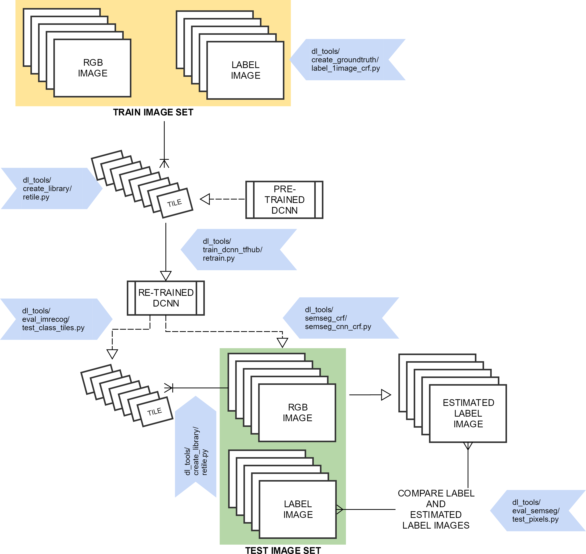
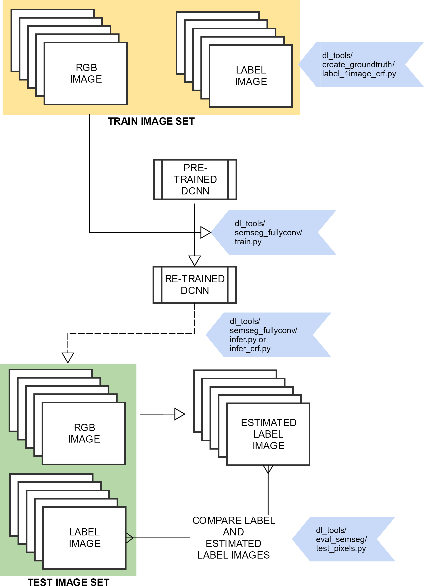

# DL tools

A collection of tools for image classification and recognition using deep transfer learning

Written by Dr Daniel Buscombe
Northern Arizona University
daniel.buscombe@nau.edu

Imagery in ```demo_data``` collected by Jon Warrick, USGS Santa Cruz

This toolbox was prepared for the "MAPPING LAND-USE, HAZARD VULNERABILITY AND HABITAT SUITABILITY USING DEEP NEURAL NETWORKS" project, funded by the U.S. Geological Survey Community for Data Integration, 2018

Thanks: Jenna Brown, Paul Grams, Leslie Hsu, Andy Ritchie, Chris Sherwood, Rich Signell, Jon Warrick


## Installation

Open an anaconda terminal and clone this repository from github

```
git clone https://github.com/dbuscombe-usgs/dl_tools.git
```


```
conda env create -f tf_env.yml 
```


You can see that this has been created in your conda env folder, e.g.


``` 
conda activate dl_tools
```


# METHOD 1



## 1) Create test an training data sets

This function is designed to take a folder of images and create a new set of testing and training images based on a specified proportional split. Training images will be used to train a model. Testing images will be used to test that model. 

```
python create_library\images_split_train_test.py -p 0.5
```

* Select a directory of images (to run using the provided demo data, select ```demo_data\jpg```)
* The program will create two new folders, ```train``` and ```test```, randomly select images and copy them into those folders.
* The proportion of total images used for training is set using the ```-p``` flag. For example, 0.5 means half the images will be selected at random and moved to the training folder


## 2) Create groundtruth (label) image using the CRF approach outlined by [Buscombe & Ritchie (2018)](http://www.mdpi.com/2076-3263/8/7/244/pdf)

```
python create_groundtruth\label_1image_crf.py -w 600 -s 0.25
```

* Select an image
* Select a labels file
* Select a label colors file


## 3) Create a library of image tiles for retraining a DCNN

```
python create_library\retile.py -t 96 -a 0.9 -b 0.5
```

* Select a directory containing mat files generated by 2)
* the ```-t``` flag specifies the tile size that the model will be trained with
* the ```-a``` flag specifies a threshold for the proportion of pixels within each tile that are identical. Tiles with less than this proportion are ignored
* the ```-b``` flag specifies the proportion of resulting randomly selected tiles to keep


## 4) Retrain a deep convolutional neural network (this example, MobilenetsV2 1.0 96)

```
python train_dcnn_tfhub\retrain.py --image_dir demo_data\test\tile_96 --tfhub_module https://tfhub.dev/google/imagenet/mobilenet_v2_100_96/classification/1 --how_many_training_steps 1000 --learning_rate 0.01 --output_labels labels.txt --output_graph monterey_demo_mobilenetv2_96_1000_001.pb --bottleneck_dir bottlenecks --summaries_dir summaries
```


## 5) Evaluate image tile classification accuracy

```
python eval_imrecog\test_class_tiles.py -n 100
```

* Select a directory containing subdirectories of tiles
* Select a labels file
* Select a model (.pb) file


## 6) Perform semantic segmentation of an image using the hybrid approach outlined by [Buscombe & Ritchie (2018)](http://www.mdpi.com/2076-3263/8/7/244/pdf)

* Make a label colors file 

```
python semseg_crf\semseg_cnn_crf.py demo_data\test\D800_20160308_221740-0.jpg monterey_demo_mobilenetv2_96_1000_001.pb labels.txt colors.txt 96 0.5 0.5 8 0.25
```


## 7) Evaluate the accuracy of the semantic segmentation 

```
python eval_semseg\test_pixels.py
```

* The program asks you to navigate to a directory that contains results from both automated and manual (ground truth) semantic segmentations on the same images
* These results files should be the .mat files generated by steps 2 and 6 above, for manual and automated approaches, respectively 
* The program assumes the manual files have the string 'mres' in the filename, and that the automated files have the string 'ares' in the file name
* For each pair of files, the program will compute accuracy metrics and print them to screen. A confusion matrix will also be printed to file


# METHOD 2



## 8) Fully convolutional semantic segmentation, implementing the method of [Long et al 2015](https://people.eecs.berkeley.edu/~jonlong/long_shelhamer_fcn.pdf) 

* Create a labeldefs.txt file, consisting of a category and associated red, green, and blue value (unsigned 8-bit integers). [This](https://www.webpagefx.com/web-design/hex-to-rgb/) is a good resource

* Run the following to make the ground truth images for the training data

```
python semseg_fullyconv\make_labels.py demo_data\data\labels\gtFine\train\data
```

* Run the following to make the ground truth images for the validation data

```
python semseg_fullyconv\make_labels.py demo_data\data\labels\gtFine\val\data
```

* Run the following to train the model (just 10 epochs, for speed)

```
python semseg_fullyconv\train.py --name data_test10 --data-source data --data-dir demo_data\data --epochs 10
```

* Run the following to use the model on unseen imagery to create a label image

```
python semseg_fullyconv\infer.py --name data_test10 --samples-dir demo_data\data\samples\RGB\val\data --output-dir test_output --data-source data
```

* select the labeldefs.txt file
* check the outputs in ```test_output```


* Run the following to use the model on unseen imagery to create a label image with CRF post-processing

```
python semseg_fullyconv\infer_crf.py --name data_test10 --samples-dir demo_data\data\samples\RGB\val\data --output-dir test_output --data-source data
```

* select the labeldefs.txt file
* check the outputs in ```test_output```


